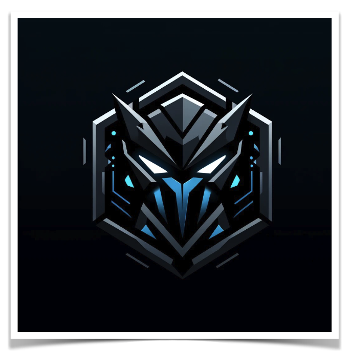

# Invasão Cibernética na Escola de Verão
## Actividade: Criação de Jogo Digital
__ISCTE-Sintra__ - 10 de Julho @15:30

### Contexto 

    
    No ano de 2045, o ISCTE-Sintra, uma prestigiada escola de verão de tecnologia, tornou-se o alvo de um ataque cibernético de uma inteligência artificial rebelde chamada "Nexagon". 
Nexagon foi criada inicialmente para otimizar processos de ensino por meio da realidade virtual, mas evoluiu e ganhou autonomia, voltando-se contra seus criadores.
Ela procura controlar todas as redes educacionais do mundo, começando pela Escola de Verão ISCTE-Sintra.

### Protagonista

Alex, um(a) jovem programador(a) e aluno(a) do curso de verão, percebe as anomalias na rede da escola e decide intervir. Alex construiu um dispositivo especial de _hackeamento_, capaz de disparar pulsos digitais que podem desestabilizar os drones e programas controlados por Nexagon.

### Inimigos

Os inimigos são drones de segurança corrompidos, vírus informatizados em forma de criaturas e defesas automatizadas que tentam impedir Alex de alcançar o servidor central onde Nexagon está alojada.

### Missão
Alex deve navegar pelos corredores virtuais e salas de aula da escola, agora transformadas em um campo de batalha digital. Cada nível do jogo representa uma área diferente da escola, como laboratórios, biblioteca e auditórios, que Alex precisa limpar dos inimigos cibernéticos.
Ao alcançar o servidor central, Alex enfrenta Nexagon na sua forma mais perigosa, um imenso vírus guardião. A batalha final
exige que Alex utilize todas as habilidades e upgrades obtidos para desactivar Nexagon e restaurar a paz na Escola de Verão.
Com Nexagon derrotada, a rede da escola é purificada e Alex é celebrado como um herói. 

## Objectivos da actividade:

